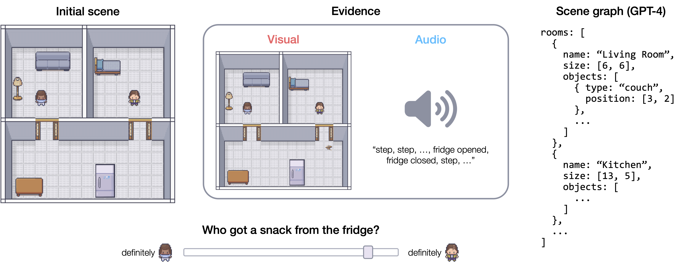

# Whodunnit? Inferring what happened from multimodal evidence

Materials for the paper "[Whodunnit? Inferring what happened from multimodal evidence](https://github.com/cicl-stanford/whodunnit_multimodal_inference/blob/main/writeup/whodunnit_0510.pdf)".

Sarah A. Wu*, Erik Brockbank*, Hannah Cha, Jan-Philipp Fr&auml;nken, Emily Jin, Zhuoyi Huang, Weiyu Liu, Ruohan Zhang, Jiajun Wu, Tobias Gerstenberg.

To be presented at the *46th Annual Conference of the Cognitive Science Society* (2024; Rotterdam, Netherlands).

```
@inproceedings{wu2024whodunnit,
  title = {Whodunnit? Inferring what happened from multimodal evidence},
  booktitle = {Proceedings of the 46th {Annual} {Conference} of the {Cognitive} {Science} {Society}},
  author = {Wu*, Sarah A. and Brockbank*, Erik and Cha, Hannah and Fr\"anken, Jan-Philipp and Jin, Emily and Huang, Zhuoyi and Liu, Weiyu and Zhang, Ruohan and Wu, Jiajun and Gerstenberg, Tobias},
  year = {2024},
}
```


**Contents:**

* [Overview](#overview)
* [Experiment](#experiment)
* [Repository structure](#repository-structure)
* [Code](#code)
* [CRediT author statement](#credit-author-statement)


## Overview

Humans are remarkably adept at inferring the causes of events in their environment; doing so often requires incorporating information from multiple sensory modalities.
For instance, if a car slows down in front of us, inferences about *why* they did so are rapidly revised if we also hear sirens in the distance.
Here, we investigate the ability to reconstruct others' actions and events from the past by integrating multimodal information.
Participants were asked to infer which of two agents performed an action in a household setting given either visual evidence, auditory evidence, or both.
We develop a computational model that makes inferences by generating multimodal simulations, and also evaluate our task on a large language model (GPT-4) and a large multimodal model (GPT-4V).
We find that humans are relatively accurate overall and perform best when given multimodal evidence.
GPT-4 and GPT-4V performance comes close overall, but is very weakly correlated with participants across individual trials.
Meanwhile, the simulation model captures the pattern of human responses well.
Multimodal event reconstruction represents a challenge for current AI systems, and frameworks that draw on the cognitive processes underlying people's ability to reconstruct events offer a promising avenue forward.




## Experiment

The experiment reported in these results was pre-registered on the Open Science Framework [here](https://osf.io/fzxre).
It can be previewed [here](https://cicl-stanford.github.io/whodunnit_multimodal_inference/experiment)!


## Repository structure

```
├── code
│   ├── analysis
│   ├── generate_audio
│   ├── generate_visual
│   ├── gpt4
│   ├── model_data
│   └── simulation_model
├── data
├── docs
│   └── experiment
├── figures
└── writeup
```

- `/code`: This folder contains the code for various aspects of the experiment and analyses.
    - `/analysis`: contains all the code for analyzing data and generating figures (view a rendered file [here](https://cicl-stanford.github.io/whodunnit_multimodal_inference)).
    - `/generate_visual`: contains code to generate the images for each trial from JSON specifications.
    - `/generate_audio`: contains code to generate the audio files for each trial.
    - `/gpt4`: This folder contains code to run GPT-4 and GPT-4V evaluations.
    - `/model_data`: This folder has trial data in the format used by the simulation model and for GPT-4 and GPT-4V evaluations. The models use a combination of evidence images, scene graph JSON files, and a CSV with transcribed audio evidence for each trial.
    - `/simulation_model`: This folder has code and output for the [simulation model](#simulation-model).
- `/data`: contains anonymized participant data from the experiment as well as GPT-4 and GPT-4V evaluation results.
- `/docs/experiment`: contains all the behavioral experiment code. You can demo the experiment [here](https://cicl-stanford.github.io/whodunnit_multimodal_inference/experiment))!
- `/figures`: contains all the figures from the paper, generated using the script in `code/analysis`.


## Code

Refer to the [documentation](code/README.md) in the `code` directory for more details about the simulation model and running various parts of the code, including
[generating trial images](code/README.md#generating-trial-images),
[running evaluations on GPT-4(V)](code/README.md#running-gpt-4v-evaluations),
and [running simulation model predictions](code/README.md#simulation-model).


## CRediT author statement

*[What is a CRediT author statement?](https://www.elsevier.com/researcher/author/policies-and-guidelines/credit-author-statement)*

- **Sarah A. Wu\***: Conceptualization, Methodology, Software, Validation, Formal analysis, Investigation, Resources, Data Curation, Writing - Original Draft, Writing - Review &amp; Editing, Visualization, Project administration
- **Erik Brockbank\***: Conceptualization, Methodology, Software, Validation, Formal analysis, Resources, Writing - Original Draft, Writing - Review &amp; Editing, Project administration
- **Hannah Cha**: Conceptualization, Methodology, Software, Writing - Review &amp; Editing, Visualization
- **Philipp Jan-Fränken**: Conceptualization, Methodology, Software, Validation, Resources
- **Zhuoyi Huang**: Conceptualization, Methodology, Software, Data Curation
- **Ruohan Zhang**: Conceptualization, Methodology, Validation, Supervision
- **Jiajun Wu**: Funding acquisition
- **Tobias Gerstenberg**: Conceptualization, Methodology, Writing - Review &amp; Editing, Supervision, Project administration, Funding acquisition
