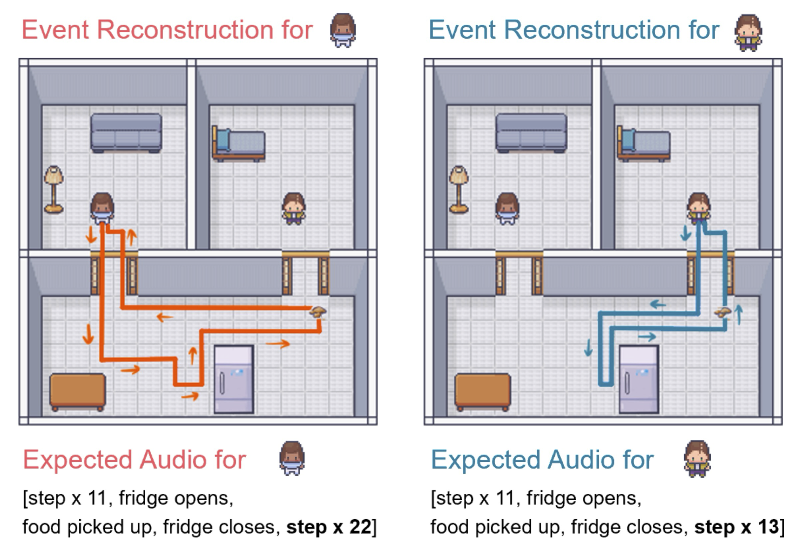

# Code for Whodunnit? Inferring what happened from multimodal evidence


**Contents:**

* [Generating trial images](#generating-trial-images)
* [Running GPT-4(V) evaluations](#running-gpt-4v-evaluations)
* [Simulation model](#simulation-model)
  * [Model overview](#model-overview)
  * [Running the model](#running-the-model)
  * [Model output](#model-output)


## Generating trial images

The code for generating images for each trial from JSON specifications on our experiment can be found in the `code/generate_visual` directory. To pick which trial to generate an image for, navigate to `code/generate_visual/js/marple-scene.js`, and change line 3 to specify which trial name to generate an image for. Trial JSONs can be found on `code/generate_visual/trials`. An example of the line can be seen below for the trial tv6_after:
```
export let gridName = "tv6_after";
```
Upon changing the trial, run the following command in terminal while in the `code/generate_visual` directory:
```
npm run serve
```
The following command will open a local browser, display the trial image, and download the image with `trial_name.png`. Changing line 3 in `code/generate_visual/js/marple-scene.js` will change which trial is displayed. 

## Running GPT-4(V) evaluations

The code for evaluating GPT-4(V) on our experiment can be found in the `code/gpt4` directory. To evaluate GPT-4, which uses scene graphs, run
```
python main_gpt4.py
```
We used the Azure OpenAI Service, so this relies on the environment variables `AZURE_OPENAI_ENDPOINT` and `AZURE_OPENAI_API_KEY`.

To evaluate GPT-4V, which uses the images from the behavioral experiment, run
```
python main_gpt4v.py
```
This relies on the environment variable `OPENAI_API_KEY`.


## Simulation model

The simulation model estimates how likely each of the two agents in a particular trial were to perform a given action (e.g., eat a snack).
At a high level, the model does this by sampling a large number of paths taken by each agent to fulfill their goal and simulating processes such as opening and closing doors and spilling food along the way.
The model then evaluates which of these simulations are consistent with available evidence (visual, audio, or both) to decide which agent was most likely to have performed the action.

The first section below describes the model in detail. The second section demonstrates how to run the model.



### Model overview

The simulation model is given a scene graph representation of the initial state in each trial, as well as "evidence" in the form of the final state (visual), a transcript of sounds (auditory), or both (multimodal).
For an agent $`a \in \{\text{agent 1},\ \text{agent 2}\}`$, the probability of the agent performing the action given the evidence $`x \in \{\text{visual},\ \text{auditory},\ \text{multimodal}\}`$ can be written as:

$$
p(a|x) = \frac{p(x|a)p(a)}{p(x)}
$$

The prior probability of each agent performing any given action $`p(a)`$ is assumed to be uniform (the identity of the agents was not a useful predictor in the task), as was the probability of receiving evidence in any particular modality $`p(x)`$.
Thus, determining which of the two agents was most likely to have caused the evidence is a function of the relative likelihoods $`p(x|a=\text{agent 1})`$ and $`p(x|a=\text{agent 2})`$.

The model estimates these likelihoods using simulations of the agents' behavior to produce a distribution of visual and auditory evidence for each agent.
To simulate behavior, the model first determines *sub-goals* for the events in each trial (for example, getting a snack involves each agent moving from their start location to the fridge, then back to the start).
Using the scene graph representation of the trial, the model generates all *simple paths* available for each sub-goal which are less than a threshold length (we used 20 steps, which ensured a large number of simple paths in each trial).
Next, simple paths are sampled from a *softmax* distribution over the negative length of the path, such that shorter paths are sampled more frequently (we used a softmax temperature 1 for all trials).

Simple paths sampled in this way are then combined to produce full paths completing the task (e.g., getting a snack by going to the fridge and back).
In the "watch TV" trials, the model includes sub-goals for each possible location the remote might be placed, then samples from these paths according to the length of the path as above.
For each of the sampled paths (we used 1000 for all trials), the model simulates agent behavior performing the task along that path and records visual and auditory evidence corresponding to the simulated behavior.
Any closed doors along the path are first opened, then closed again according to a draw from a binomial distribution with $`p=0.5`$.
For "watch TV" paths directly back from the couch, the remote is placed on the table or moved to the side table on the way back according to another binomial draw ($`p=0.5`$) (if traveling back by way of the "far" end table, the remote is placed there no matter what).
The model does not simulate dropping crumbs, but instead considers any square on the path back through the kitchen a "candidate" crumb location.

After simulating each agent's behavior along the set of sampled paths for each trial, the model constructs representations of the corresponding visual and auditory evidence produced by these simulations.
Visual evidence simply records the state of all doors (open or closed), the possible crumb locations, and the remote location.
Auditory evidence is stored as a sequence of the events that took place (e.g., "step", "step", "door opened", ...).

Finally, for each trial, the model calculates the likelihood of the provided audio, visual, or multimodal evidence for each agent $`p(x|a)`$ using *rejection sampling* over the distribution of evidence generated through the simulations above.
For visual evidence, the probability of each agent $`p(a|x)`$ was merely the proportion of simulations for that agent in which the door states matched exactly and the crumbs (if there were any) were in a "candidate" location.
For audio evidence, the stream of audio evidence was compressed to a representation that encoded the number of steps taken between events and the events themselves.
The simulated audio streams (compressed in this way) are considered a "match" with the (compressed) audio evidence so long as all events line up and the number of steps in any step sequence differs by less than a threshold difference $`\delta`$ (we used $`\delta=4`$ for all trials).
This encoding scheme allows for the fact that participants did not need to use the exact step count between events but rather a rough magnitude estimate of what would be expected for each agent compared to what was heard (exact comparison is a special case of this reasoning with $`\delta=0`$).
For multimodal reasoning, the model simply combines the comparisons described above such that simulated agent paths only "match" the evidence when both visual and auditory representations are consistent with the evidence.

After determining the probability of each agent completing the event in a given trial $`p(a|x)`$, the model produces a slider value $`\hat{y}`$ to match participants' responses by normalizing these probabilities: $`\hat{y} = \frac{p(a|x)}{\sum_{i} p(a_i|x)}`$.


### Running the model

Make sure you're in the `simulation_model` directory and can see `main.py`.
This is the primary file for running the simulation model.

To run the file, first make sure you've installed all the required python libraries listed in `requirements.txt`.
If you have the python package installer [pip](https://pypi.org/project/pip/) already, you can install the necessary libraries with `pip` by running this command:
```
pip install -r requirements.txt
```

Now it's time to run the model!
The basic command structure for running the model is:
```
python main.py simulate --trial {TRIAL default: 'all'} --evidence {'visual' | 'auditory' | 'multimodal' default: 'multimodal'}
```

The `simulate` call runs the simulation model process the trial designated by the `--trial` flag and the evidence type designated by the `--evidence` flag.

The `--trial` flag expects a string that either indicates a single trial from the experiment or 'all' to run the model on *all* experiment trials.

> [!IMPORTANT]
> The model retrieves information about the desired trial(s) from the `model_data` folder in the parent directory. If running the model for a single trial, the name provided must match one of the trial names from the experiment. These can be found in the 'trial' column of the audio evidence CSV file (`model_data/audios.csv`) or in the folder of scene graphs (`model_data/trial_jsons`). In this folder, each trial has two scene graph JSON files representing the state of the environment before and after the action was performed (e.g., `snack1_before.json` and `snack1_after.json`).

If trial name provided with the `--trial` flag does not match a valid trial, the model will raise an exception.

Next, the `--evidence` flag expects a string that indicates the evidence type to use for the model simulations.
This string *must* be one of 'visual', 'audio', or 'multimodal', otherwise the model will raise an argparse error (the default value is 'multimodal').

Here's an example model simulation evaluating *visual* evidence for the `snack1` trial:
```
python main.py simulate --trial 'snack1' --evidence 'visual'
```

Here's an example model simulation evaluating visual evidence on *all* trials:
```
python main.py simulate --trial 'all' --evidence 'visual'
```

The model code currently accepts one additional flag:
- `--model-version {VERSION default: 'simulation'}`: the `model-version` flag can be passed a string. The default value for this is 'simulation'. The value of this flag is appended to the name of all CSV files written to the `model_results` directory so that results obtained with different versions of the model can be easily differentiated.

### Model output

When running the model for *single* trials, the model prints the result of the simulations but does not write these results anywhere.
However, when running the model on all experiment trials, the model prints the results of these simulations to a CSV in the `model_results` directory, which is located in the same `simulation_model` folder as the model code itself.
The model prints the name of the CSV file it writes to, which has the format: `results_{model_version}_{evidence}.csv` (e.g., `results_simulation_multimodal.csv`).

This CSV file has the following columns:
- `trial`: the name of the trial (e.g., 'snack1')
- `visual`: whether the model run used visual evidence ('True' for `--evidence 'visual'` and `--evidence 'multimodal'`)
- `audio`: whether the model run used audio evidence ('True' for `--evidence 'audio'` and `--evidence 'multimodal'`)
- `judgment`: the predicted slider value from the simulation model (NB: this is the key output for the model!)
- `model_samples` (*free parameter*): the number of sample paths the model used to simulate each agent's behavior (default: 1000)
- `model_path_length_cutoff` (*free parameter*): the maximum length of the simple paths used to simulate agent behavior (default: 20)
- `model_door_close_prob` (*free parameter*): the probability that each agent closes the door behind them in simulated paths (defualt: 0.5)
- `model_softmax_temp` (*free parameter*): the softmax temperature used for sampling simple paths during simulation (default: 1.0)
- `step_count_difference_threshold` (*free parameter*): the difference threshold used to determine whether the number of steps in simulated paths *matches* the number in audio evidence for that trial (default: 4)

This CSV file is used to compare participants' responses on each trial to the model predictions for each evidence condition.
